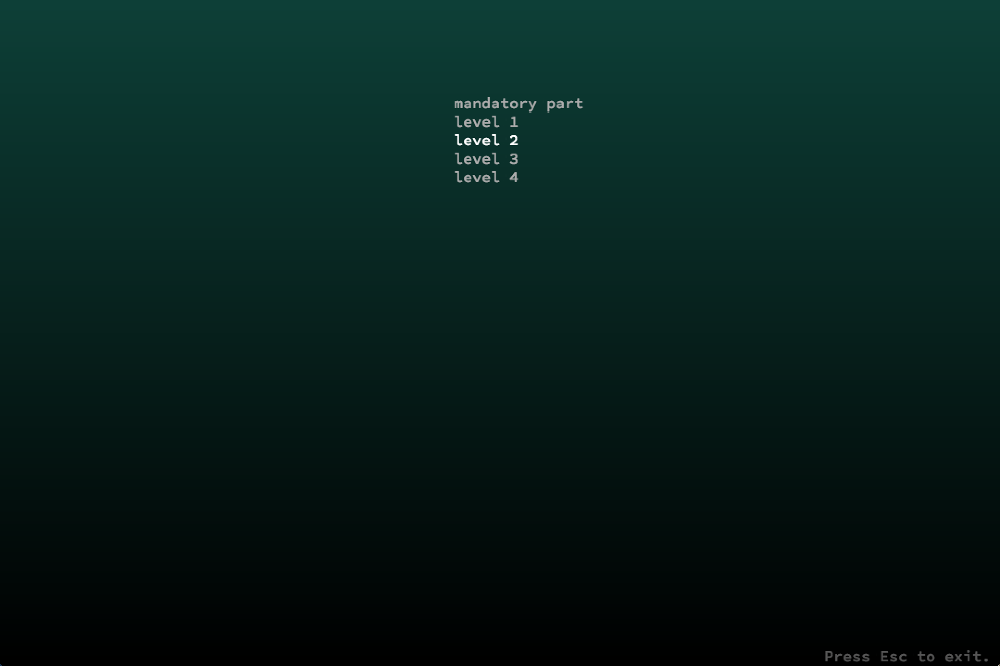
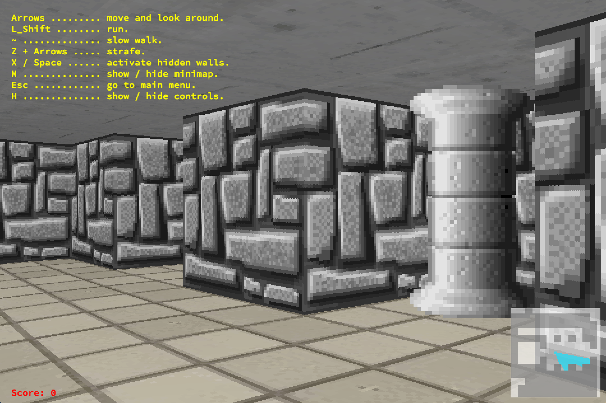
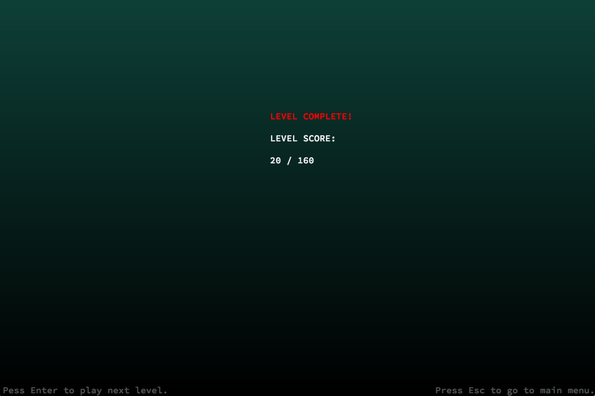

# Wolf3d
Wolf3d is a pseudo-3d game. The project was developed as a part of 42 school program.
It parses maps from files, visualizes them using ray-casting technique and applyes simple game logic.

## Installation
Clone or download this repository and run `make` in command line while in the root of the repository.
This will build executable called Wolf3d.

## Usage
`./Wolf3d [filename] ...`  
`filename` must contain path to a valid map.  
Or enter `sh run.sh` to run all basic maps.

## Features
- Main menu
- Ability to open multiple maps
- Minimap
- Secret walls
- Collectables
- Classic Wolfenstein 3d textures

## More Screenshots
Main menu:  
  

Press `H` to toggle help:  
  

End level menu:  
  

  

  

Secret walls can be opened by pressing `Spase Bar` or `X`  

  

  
