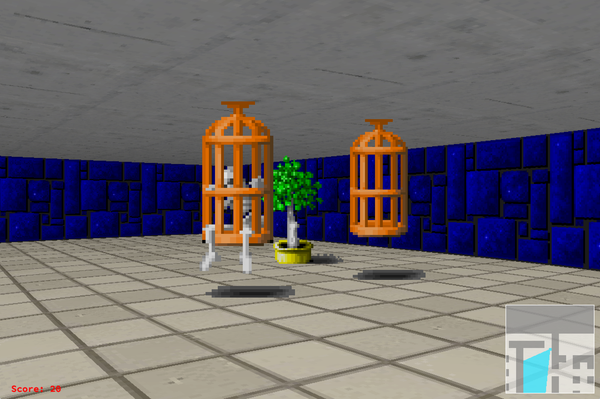

# Wolf3d
Wolf3d is a pseudo-3d game. The project was developed as a part of 42 school program.
It parses maps from files, visualizes them using ray-casting technique and applyes simple game logic.

## Installation
Clone or download this repository and run `make` in command line while in the root of the repository.
This will build executable called Wolf3d.

## Usage
`./Wolf3d [filename] ...`  
`filename` must contain path to a valid map.  
Or enter `sh run.sh` to run all basic maps.

## More Screenshots

